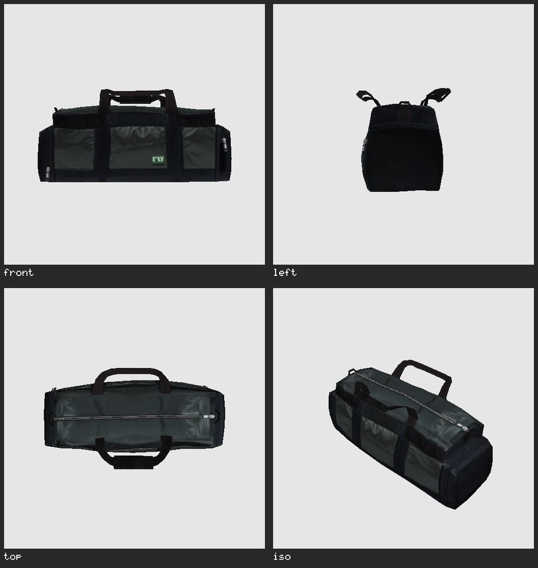
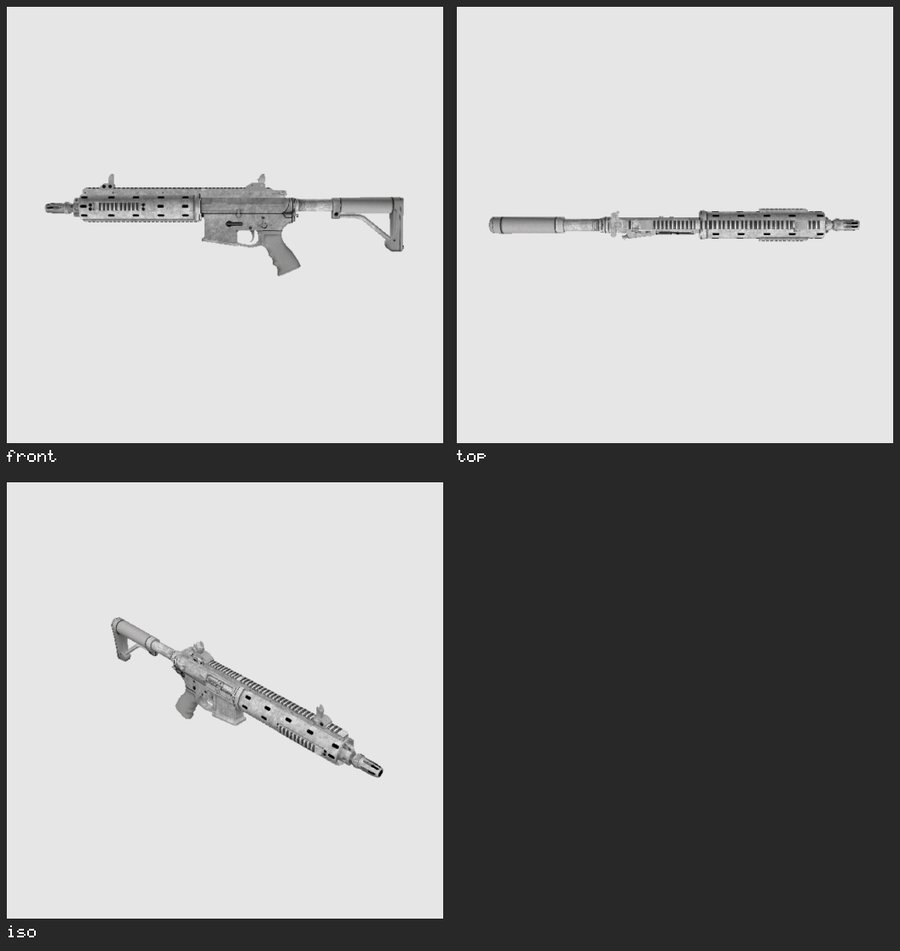
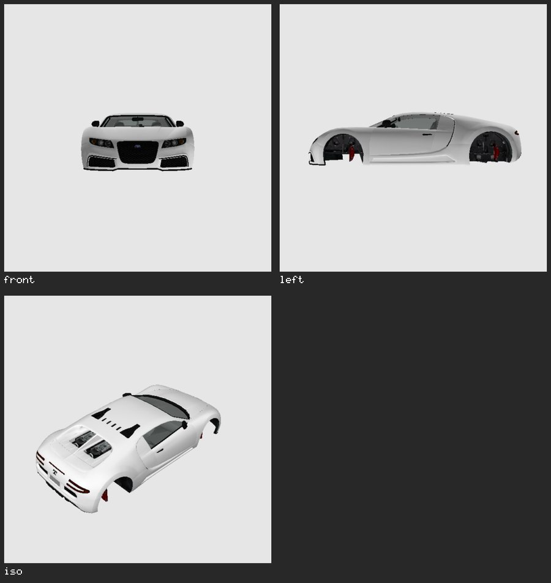
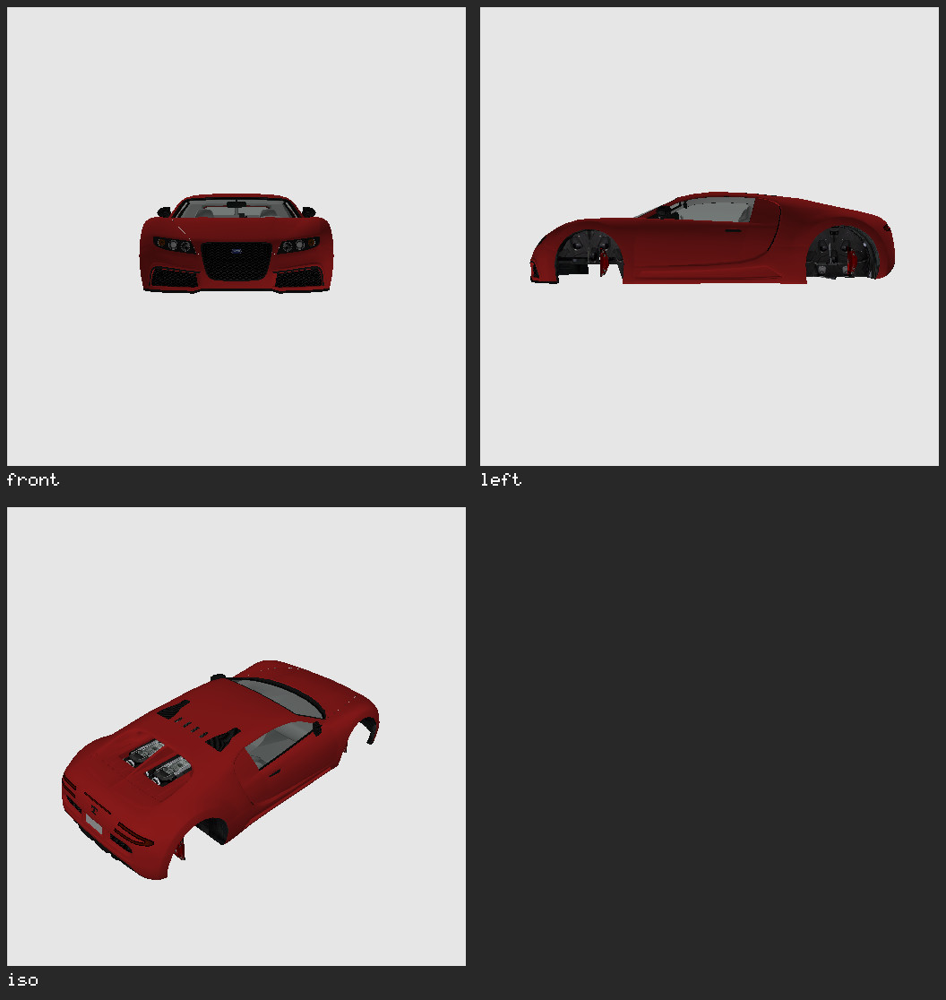
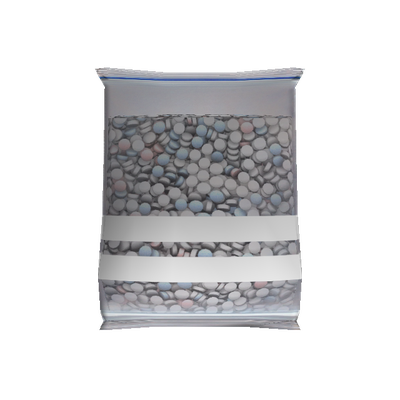
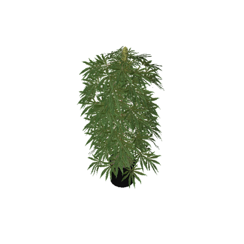
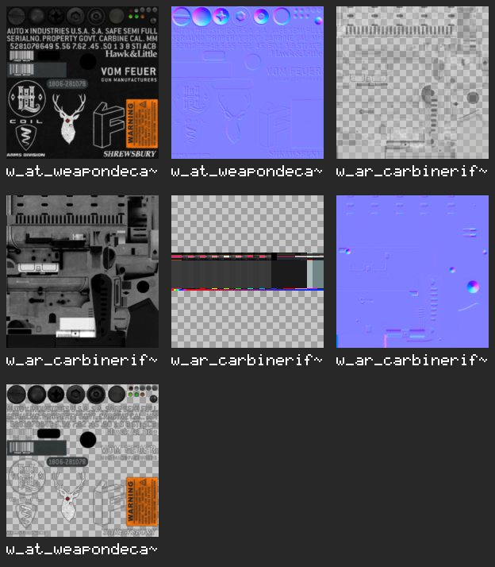

# RPF-CLI

A fast, safe, and cross-platform command-line tool for working with RAGE Package Files (RPF), written in Rust.

It reads GTA V's RPF7 archives (including the encrypted retail ones, given your own game install), finds files
across nested archives without extracting them, pulls textures out as ordinary images, and renders models to
pictures from the terminal — no CodeWalker, no GPU.



Currently, this tool is a work in progress and only supports RPF7 archives (GTA V).

Drop a star if you've found this tool useful.

## Install

Prebuilt Windows and Linux binaries are attached to every
[release](https://github.com/VIRUXE/rpf-cli/releases). Or build from source:

```sh
cargo install --git https://github.com/VIRUXE/rpf-cli
```

## Commands

```
info          Display information about an archive
list          List files, optionally filtered by pattern
search        Find files by name, contents or hash inside archives (and nested archives) without extracting
extract       Extract files, with --recursive to descend into nested archives
verify        Verify archive integrity
tree          Display contents as a tree
textures      Export textures from a .ytd/.ydr/.ydd/.yft as PNG/JPG/WebP (alias: ytd; --dds for raw DDS)
screenshot    Render a .ydr/.ydd/.yft to an image (auto-framed, multi-view, external --ytd)
resource      Inspect a loose resource file, or an entry inside an archive (`resource info`)
create        Create an archive from a directory
extract-keys  Write the keys out to disk for reuse with --keys
```

Reading retail game archives needs keys — see [Keys](#keys). Archives that are not
encrypted, such as FiveM resource packs, need no setup at all.

The examples below use `<GTA V>` for the game folder, e.g.
`C:/Program Files (x86)/Steam/steamapps/common/Grand Theft Auto V`, with
`GTAV_PATH` pointing at it.

## Examples

### Look inside an archive

```sh
rpf info mp_biker_weed.rpf
rpf tree mp_biker_weed.rpf
rpf list mp_biker_weed.rpf "*bag*"
```

```
RPF Archive Information
======================
Entries:     70 (1 dirs, 69 files)
Encryption:  NG
Total size:  7375256 bytes (7.03 MB)

mp_biker_weed.rpf
├── _manifest.ymf (2.40 KB)
├── bkr_mp_biker_weed.ytyp (4.26 KB)
├── bkr_prop_fertiliser_pallet+hi.ytd (290.52 KB)
├── bkr_prop_fertiliser_pallet.ytd (110.82 KB)
├── bkr_prop_fertiliser_pallet_01a.ydr (134.05 KB)
├── bkr_prop_grow_lamp_02b+hidr.ytd (438.45 KB)
…
```


### Find anything, anywhere

`list` only sees one archive's top level. `search` descends into nested `.rpf`
entries in memory, and takes a directory to cover every archive under it:

```sh
rpf search "<GTA V>/x64c.rpf" "prop_cs_heist_bag*" -d    # which nested rpf holds it, with details
rpf search "<GTA V>" "*.ymt" --json                       # every .ymt in the whole install
rpf search "<GTA V>/x64a.rpf" --content binoculars -i     # bytes inside files (resources are inflated)
rpf search "<GTA V>/x64b.rpf" --hex "52 53 43 37" --limit 5
rpf search "<GTA V>/x64a.rpf" --hash 0x6D8A1F3C           # JOAAT of a name or stem
```

```
Path                                                                  Size   MemSize  Type      Hash
--------------------------------------------------------------------------------------------------------
<GTA V>/x64c.rpf:x64c.rpf/levels/gta5/props/lev_des/lev_des.rpf/prop_cs_heist_bag_01.ydr        170163  65536  Resource  0xE81D7506
<GTA V>/x64c.rpf:x64c.rpf/levels/gta5/props/lev_des/lev_des.rpf/prop_cs_heist_bag_02+hidr.ytd   548154   8192  Resource  0xA798254B
<GTA V>/x64c.rpf:x64c.rpf/levels/gta5/props/lev_des/lev_des.rpf/prop_cs_heist_bag_02.ydr        192198  98304  Resource  0xD7A1647F
```

Hits print as `<archive>:<path/inside/nested.rpf/file>`, one per line, and `--json`
emits an array with the same fields plus the match offset:

```json
[
  {"archive":"<GTA V>/x64c.rpf","path":"x64c.rpf/levels/gta5/props/lev_des/lev_des.rpf/prop_paper_bag_small.ydr",
   "name":"prop_paper_bag_small.ydr","size":8193,"mem_size":24576,"kind":"resource",
   "hash":"0x167D347D","stem_hash":"0x947A8766","offset":null}
]
```

A pattern without wildcards is a substring match on the full path, so `inner.rpf`
returns the archive and everything under it. Filters combine with AND, and the
summary goes to stderr so stdout stays clean for piping.

### Extract files and nested archives

```sh
rpf extract resource.rpf -o ./out                       # everything
rpf extract "<GTA V>/x64e.rpf" "*/vehicles.rpf" -o ./nested   # one nested archive, as a file
rpf extract "<GTA V>/x64e.rpf" "*/weapons.rpf" -o ./nested
rpf extract "<GTA V>/x64b.rpf" -o ./nested --recursive  # descend into every nested rpf, to loose files
```

Retail `x64*.rpf` archives keep drawables inside nested RPFs, so a model has to
be extracted to disk before `textures` or `screenshot` can open it. `search`
tells you which nested archive holds it, and the extracted path mirrors that
archive's own folder layout (`./nested/levels/gta5/vehicles.rpf` above).

### Render a model to an image

`screenshot` frames the model automatically and renders it from any of six
fixed angles (`front`, `back`, `left`, `right`, `top`, `iso`; a view named
twice is rendered once). `--grid` collects the views into one labelled image,
always on its own dark background so the labels stay legible whatever
`--background` the renders use:

```sh
rpf screenshot ./nested/models/cdimages/weapons.rpf w_ar_carbinerifle.ydr --views front,top,iso --grid
```



Textures a model references but does not carry come from `--ytd`, repeatable,
earlier ones winning. A vehicle takes its own dictionary plus the shared one:

```sh
rpf screenshot ./nested/levels/gta5/vehicles.rpf adder.yft --views front,left,iso --grid --ytd adder --ytd vehshare
```



Textures a model asks for but no dictionary supplies are drawn flat grey and
listed by name, so the output itself tells you which `--ytd` to pass next.
Geometries whose shader names no diffuse texture at all (lights, glass) are
grey too, but counted apart as `N with no diffuse`: no dictionary will fill
those in.

A YFT is rendered as one piece: its main body, posed by the fragment's default
bone transforms, plus every physics child that carries a mesh, placed by its
physics transform. Vehicle wheels are the usual case. A YFT typically ships one
front and one rear wheel mesh; the other wheel slots borrow those and right-hand
wheels are mirrored, the same way CodeWalker fills them in. The summary line
counts the parts drawn, e.g. `5 parts (4 wheels)`. Damaged variants of a part
are not drawn.

Vehicle bodies come out white because the paint colour is not in the YFT: the
game applies it at runtime from carcols metadata. `--paint #rrggbb` tints every
geometry drawn with a `vehicle_paint*` shader and leaves glass, lights, tyres
and interiors alone:

```sh
rpf screenshot ./nested/levels/gta5/vehicles.rpf adder.yft --views front,left,iso --grid --ytd adder --ytd vehshare --paint "#8b1a1a"
```



### Transparent backgrounds and translucent materials

`--background` takes `grey` (default), `transparent`, or any `#rrggbb`. With a
PNG or WebP output the alpha channel is real, so the render drops straight onto
any page. Materials keep the blend mode the game gives them: cut-out foliage is
alpha-tested, and translucent plastic or glass is blended over what sits behind it.

```sh
rpf screenshot ./nested/lev_des_mp_dlc.rpf hei_prop_pill_bag_01.ydr --views front --background transparent
rpf screenshot ./nested/mp_biker_weed.rpf bkr_prop_weed_lrg_01a.ydr --background transparent --ytd bkr_prop_weed
```

<p>
  
  
</p>

### Export textures as images

```sh
rpf textures ./nested/models/cdimages/weapons.rpf w_ar_carbinerifle.ytd            # PNGs into ./w_ar_carbinerifle
rpf textures ./nested/models/cdimages/weapons.rpf w_ar_carbinerifle.ytd --sheet --max-size 256 --format webp
rpf textures ./nested/levels/gta5/props/lev_des/lev_des.rpf prop_cs_heist_bag_02.ydr   # textures baked into a drawable
```

Every texture in a dictionary lands in a folder named after it. `--sheet` adds
one labelled contact sheet of the lot, with a checkerboard behind anything that
has alpha:



PNG is lossless and the best default. WebP output is lossless-only, JPEG drops
the alpha channel, and `--max-size` caps the longest edge so files stay small.
The old `ytd` command still works as an alias for `textures`, and `--dds`
restores its original raw-DDS output.

### Inspect a resource file

```sh
rpf resource info ./out/prop_my_thing.ydr                   # a loose file, e.g. one you just exported
rpf resource info --archive "<GTA V>/x64a.rpf" binoculars.ytd
rpf resource info ./out/prop_my_thing.ydr --json            # one JSON object for scripts
```

Prints the RSC7 header (version, system/graphics page flags and the sizes they
encode, whether the body is deflated or stored) and then what the file holds:
every texture of a `.ytd` in the same per-line format `textures` uses, or, for
a `.ydr`/`.ydd`/`.yft`, each drawable's bounds, LOD distances, per-LOD model,
geometry and triangle counts, the shader table with diffuse texture names, and
the embedded textures. Handy for checking an export before it goes into a
stream folder: a bad magic or a zero-triangle high LOD shows up immediately.

### Pictures for vision models

Every image command writes ordinary picture files, so a vision model can look
at a model or texture the same way you do. A model does not need more than
roughly 1500 px on the longest edge, and `--json` output from `search` gives it
a path to act on. A typical loop that finds every bag prop in the game, extracts
the archives that hold them, and renders each one looks like this:

```sh
rpf search "<GTA V>" "*bag*.ydr" --json > bags.json
# extract each distinct nested archive from bags.json, then:
rpf screenshot ./nested/.../mp_biker_weed.rpf bkr_prop_weed_bag_01a.ydr --size 512x512 --format jpg --ytd bkr_prop_weed
```

A full-install `*.ydr` search takes around two minutes and a single 512 px render
under two seconds, so a few hundred props are a coffee break.

### Drawable dictionaries and fragments

Entries in a `.ydd` mostly share one name — the file's own — so they are
reported and written out as `0x<hash>` instead, and that hash is what `--entry`
takes to pick one of them:

```sh
rpf screenshot ./nested/some_dictionary.ydd --views front,iso        # every entry, named by hash
rpf screenshot ./nested/some_dictionary.ydd --entry 0x<hash> --views front,iso
```

## Keys

Retail archives are NG-encrypted, so reading them needs keys from your own game
install. Point the tool at the game once and forget about it:

```sh
export GTAV_PATH="<GTA V>"          # or the full path to GTA5.exe
rpf list "<GTA V>/x64a.rpf" "*.ytd"
rpf textures "<GTA V>/x64a.rpf" binoculars.ytd
```

`--exe <PATH>` does the same thing per-run and overrides the variable. Either
form takes the executable itself or the folder holding it. Recovering the keys
from the executable costs a couple of seconds, so the result is cached per
game build (keyed on the executable's size and modification time) under
`~/.rpf-cli/keys`; set `RPF_KEYS_CACHE` to put it somewhere else. Later runs load in milliseconds,
and a game update simply produces a new entry. An unwritable cache is not an
error, the keys are just recovered every time.

To manage a copy on disk yourself, write it out once and use `--keys`, which
takes precedence over `--exe`:

```sh
rpf extract-keys --exe "<GTA V>/GTA5.exe" -o ./keys
rpf list --keys ./keys "<GTA V>/x64a.rpf" "*.ytd"
```

Only the AES key is still stored as plain bytes in GTA5.exe. Newer builds no
longer carry the NG keys or decrypt tables, so those are unwrapped from a
`magic.dat` compiled into the binary, using the AES key found in your
executable.

That `magic.dat` comes from CodeWalker, which generates it by deflating the NG
keys and decrypt tables, encrypting them with the AES key, and masking the
result with a seeded .NET PRNG stream. Unwrapping therefore needs an AES key
from a real game executable, so the keys stay inert without one. The key
material itself is the same across game versions — extracting once is enough.

## Releasing

`rpf-cli` depends on the published [`rpf-archive`](https://github.com/VIRUXE/rpf-archive-rs)
crate. To build against the sibling checkout without editing `Cargo.toml`:

```sh
cargo install --path . --config 'patch.crates-io.rpf-archive.path="../rpf-archive-rs"'
```

To cut a release:

1. If a library change is needed, publish `rpf-archive` to crates.io first and
   bump the version this crate pins.
2. Bump this crate's version in `Cargo.toml` and rebuild so `Cargo.lock` follows.
3. Commit, then `gh release create vX.Y.Z --notes ...` — the tag triggers the
   `release` workflow, which builds the Linux and Windows binaries and attaches
   them to that release.

Publishing itself is a manual, deliberate step — nothing here does it for you.

## Acknowledgements

- CodeWalker (<https://github.com/dexyfex/CodeWalker>)
- Swage (<https://github.com/0x1F9F1/Swage>)
- Contributors of <https://gtamods.com/wiki/RPF_archive>
